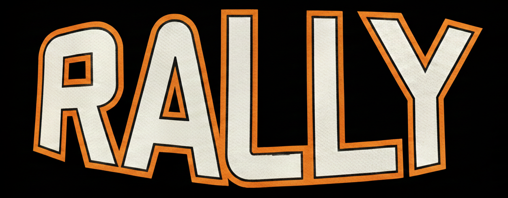

# Rally

<p align="center">
  
</p>

**A voice-first workout tracker for iOS.** Say what you lifted, Rally logs it.

## Why

Typing a workout into an app between sets is annoying, especially with chalk on your hands or gloves on. Rally is built around talking instead of tapping: record a sentence like *"benched two plates for 5, then dropped to a plate and a 25 for 8"* and it comes out as a structured, saved set — weight, reps, and exercise name all parsed correctly.

## How it works

1. **Record** — tap the mic, describe the set in plain English (gym slang included)
2. **Transcribe** — on-device speech recognition (Apple's Speech framework) turns audio into text, with an OpenAI Whisper fallback for noisier environments
3. **Parse** — the transcript goes to GPT-4o-mini with a system prompt trained on gym shorthand (plate math, "quarter"/"dime"/"nickel", muscle-group slang, AMRAP, supersets, drop sets, etc.), which returns structured exercise data
4. **Fall back offline** — if there's no API key or the LLM call fails, a regex-based parser (`OfflineWorkoutParser`) handles the same input locally, so the app still works with zero network access
5. **Save** — the parsed sets land in a SwiftData model, immediately visible in history and progress views

## Features

- **Ghost sets** — see your numbers from the last time you did an exercise, right next to what you're logging now
- **E1RM tracking** — estimated 1-rep max (Epley formula) calculated per set and charted over time
- **Exercise recommendations** — suggests exercises by muscle group based on your workout so far and your history
- **Equipment-aware weight math** — knows barbell/EZ-bar/trap-bar/Smith-machine base weights so "a plate" resolves correctly
- **Exercise name normalization** — matches loose input ("benchin'", "flat bench") to canonical exercise names via alias matching and fuzzy (Levenshtein) fallback
- **Media attachments** — attach photos or video to a workout
- **Progress charts** and a weekly training breakdown
- **Daily reminder notifications**
- **Offline-first** — full logging flow works without an API key or network connection

## Tech stack

| Layer | Choice |
|---|---|
| UI | SwiftUI |
| Persistence | SwiftData |
| Speech-to-text | Apple Speech framework (on-device) + OpenAI Whisper API (fallback) |
| Workout parsing | GPT-4o-mini (structured JSON output) + regex fallback parser |
| Min. target | iOS 17 |

## Project structure

```
Rally/
├── RallyApp.swift              Entry point, SwiftData model container
├── Models/                     Workout, Exercise, ExerciseSet, WorkoutMedia
├── Views/                      Record, History, Progress, Onboarding, Detail views
│   └── Components/             Reusable UI pieces (charts, cards, record button)
├── Services/
│   ├── SpeechRecognitionService.swift    On-device transcription
│   ├── WhisperService.swift              Whisper API fallback
│   ├── LLMWorkoutParser.swift            GPT-4o-mini parsing + gym-slang prompt
│   ├── OfflineWorkoutParser.swift        Regex fallback parser
│   ├── GhostSetService.swift             Previous-session comparisons
│   ├── E1RMCalculator.swift              Epley formula 1RM estimation
│   ├── ExerciseRecommendationService.swift
│   ├── ExerciseNormalizationService.swift
│   ├── EquipmentService.swift            Plate/bar weight math
│   ├── MediaService.swift                Photo/video attachments
│   └── NotificationService.swift         Daily reminders
└── Resources/ExerciseDatabase.json
```

## Running it

1. Open `Rally.xcodeproj` in Xcode 15+
2. Build and run on an iOS 17+ simulator or device
3. (Optional) Add an OpenAI API key in the app's Settings screen to enable LLM-based parsing and Whisper transcription — without one, Rally falls back to fully offline, on-device parsing

## Status

Actively developed. Current focus: improving exercise-name normalization coverage and expanding the ghost-set comparison to full workout sessions, not just individual exercises.
